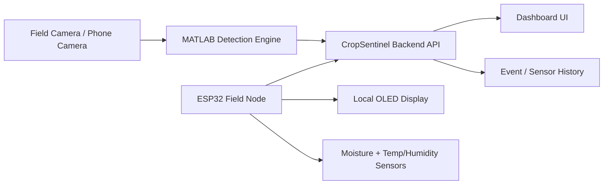
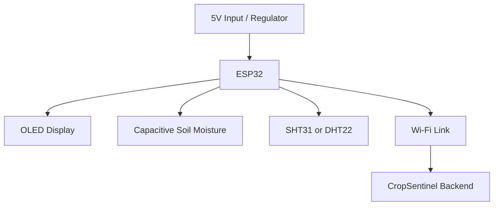

# CropSentinel Product Architecture

This document reframes CropSentinel as a deployable farm product rather than a classroom prototype.

## Product Goal

Build a field-ready pest monitoring system that:

- detects pests from live camera imagery
- correlates pest activity with local field conditions
- shows alerts in a dashboard
- remains serviceable for a farmer or technician in the field

## Product Scope For Version 1

Version 1 should focus on the smallest useful system that can survive real use:

- camera-based pest detection
- one field node with ESP32
- local sensing for soil moisture and air humidity/temperature
- local service display on the node
- dashboard for alerts, device status, and history

## System Split



## Product Modules

### 1. Vision Layer

Purpose:

- identify pest presence
- classify pest type
- send confidence and bounding box

Recommended implementation:

- fixed field camera or phone camera for pilot
- MATLAB for first inference pipeline
- later move to a more automated inference service if needed

### 2. Field Node

Purpose:

- collect environmental context
- show local health on display
- send telemetry to the backend

Current version:

- ESP32
- OLED display
- soil moisture sensor
- humidity/temperature sensor

### 3. Backend

Purpose:

- collect detections from MATLAB
- collect telemetry from ESP32
- merge both into one farm-risk view

Current implementation:

- lightweight Node server
- REST endpoints for detections and sensors

### 4. Dashboard

Purpose:

- show live detection status
- show device sync health
- show moisture / humidity / temperature
- show detection overlays and event feed

## Product-Grade Hardware Direction

### Keep

- `ESP32`
- `camera`
- `dashboard`
- `OLED display` for service/debug

### Upgrade Before Deployment

- replace cheap resistive moisture probe with `capacitive soil moisture sensor`
- prefer `SHT31` or similar over low-end humidity sensors if budget allows
- move from loose jumper wiring to connectors and proper harnessing
- add sealed enclosure and cable glands
- use stable regulated power

### Optional For Later

- relay output
- dosing / spray control
- solar + battery power subsystem
- LTE/LoRa if Wi-Fi is weak in the field

## Recommended Node Architecture



## Data Model

### Detection Payload

Generated by MATLAB:

```json
{
  "pestName": "Whitefly",
  "confidence": 0.91,
  "source": "MATLAB",
  "zone": "Leaf Row 3",
  "boundingBox": {
    "x": 0.18,
    "y": 0.26,
    "width": 0.22,
    "height": 0.24
  },
  "fps": 18,
  "framesReviewed": 12
}
```

### Sensor Payload

Generated by the ESP32:

```json
{
  "deviceId": "ESP32-GROW-01",
  "sensors": {
    "moisture": 41,
    "humidity": 67.5,
    "temperature": 29.8
  }
}
```

## Product Risks

### Sensor Drift

- cheap moisture probes can corrode and drift badly
- humidity sensors need shielding from direct rain and splash

### Connectivity

- field Wi-Fi can be unreliable
- backend should tolerate delayed posts and stale device state

### Enclosure

- poor sealing will kill the electronics faster than software bugs

### Serviceability

- if a farmer cannot read status quickly, maintenance becomes painful

## Product Decisions For This Repo

- keep the current Node backend as the integration hub
- keep MATLAB as the first pest detection engine
- keep the ESP32 field node simple in version 1
- design the hardware around reliability first, not maximum features

## Next Engineering Step

After this architecture, the next practical step is:

1. finalize the product BOM
2. define pilot enclosure and power strategy
3. calibrate the field node sensors
4. connect one real camera stream and one real ESP32 node end to end
